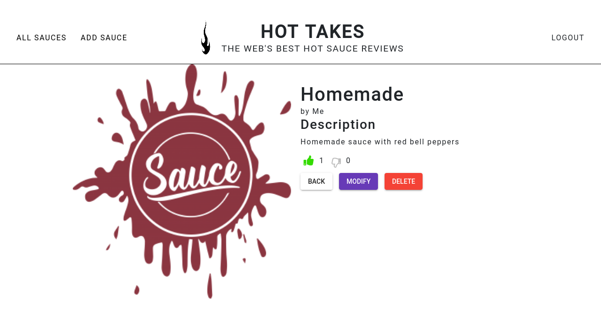

# Piiquante - projet Openclassrooms
Sixième projet du parcours **développeur web** chez **Openclassrooms**, dont l'objectif est de développer le backend d'une application web de critique de sauces piquantes "Hot Takes" en construisant une API.

## Eléments fournis par l'entreprise virtuelle
- La partie Frontend, développée avec Angular, est fournie dans un [repository Github](https://github.com/OpenClassrooms-Student-Center/Web-Developer-P6)
- Les spécifications de l'API (routes) et des différents modèles sont également mis à disposition [(fichier PDF à télécharger)](https://s3.eu-west-1.amazonaws.com/course.oc-static.com/projects/DWJ_FR_P6/Requirements_DW_P6.pdf)

## Installation et usage
- Cloner le repository
- Se déplacer dans le dossier Backend
- Lancer la commande `npm install`
- Créer un fichier *.env* contenant les variables **DB_URI** (chaîne permettant la connexion à la base de données) et **TOKEN_KEY** (chaîne d'encodage du token)
- Lancer le serveur avec la commande `npm start`

- Suivre les procédures d'installation de la partie Frontend.

## Cahier des charges

### Fonctionnalités et contenu
Cette première version sera une galerie de sauces, ajoutées par les utilisateurs, qui pourront également les noter (likes/dislikes)
- Création d'un compte utilisateur et connection avec création d'un token valide
- Création, modification et suppression d'une sauce par son propriétaire uniquement
- Upload d'une image d'illustration ou d'un logo pour chaque sauce
- Notation disponible pour tous les utilisateurs (likes/dislikes)

### Contraintes techniques et sécurité
- Le serveur du backend doit être initialisé sur le port 3000
- Les mots de passe des utilisateurs doivent être protégés et hachés.
- Toutes les routes *Sauce* requièrent une authentification (autorisation via le token envoyé par le frontend)
- Les adresses e-mails enregistrées dans la DB sont uniques, et doivent donc être vérifiées à la création de compte.
- Le plugin Mongoose doit capter l'ensemble des erreurs issues de la base de données
- le contenu du dossier *images* ne doit pas être téléchargé sur Github, et doit donc être intégré au fichier gitignore.
